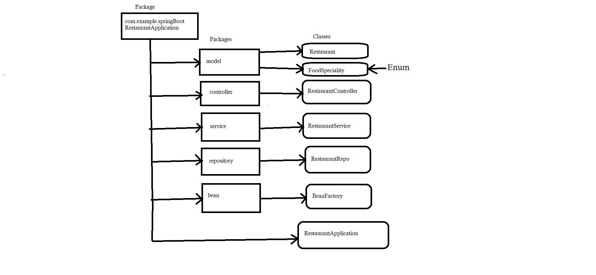

## Frameworks and language used 
* SpringBoot Framework and java language.
## Data Flow

## Data Structure used in your project
* Arraylist
## Project Summary

This is the "Restaurant Application" which following the mvc-Architecture. I have created a package of springBootRestaurantApplication within this package I have created Five more packages to define layer as given in DFD. In this project a Restaurant has specific Id , name , address , foodSpeciality , Restaurant Number ,totalStaff , staffSlary , foodRate which giving the whole information of the Restaurant.
So here we are performing crud operations on it with the help of endpoints like @GetMapping to get all the information of the Restaurant, @PostMapping to create a Restaurant Information using the attributes,
@PuMapping to update the Food Speciality using Restaurant Id, @deleteMapping to remove a Restaurant from list by giving specific Restaurant Id and also providing specific restaurant information by giving Restaurant Id.That's the whole project meant. 
